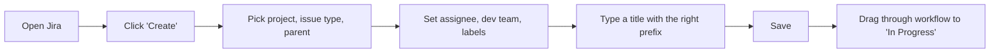
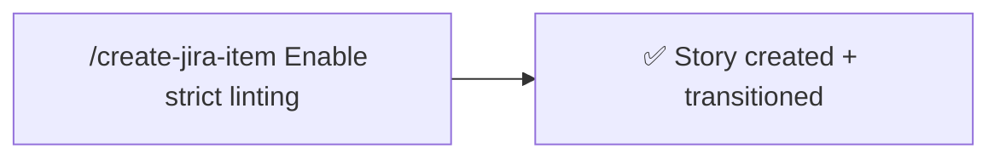

# create-jira-item

Create a Jira work item without filling out the long form. Pulls every field default — issue type, projectKey, parent, dev team, assignee, labels, initial workflow status — from your [`jira-defaults`](../../../jira-defaults/skills/jira-defaults/README.md) file. You provide a title (or let the skill suggest one); everything else is sourced or asked only when the defaults can't cover it.

### Old way



### New way



## Usage

Pass a title, or let the skill suggest one.

### As a slash command

```
/create-jira-item Enable strict linting
```

```
/create-jira-item
```

(no title — the skill proposes 3 options based on the current repo)

### As a natural-language skill

Trigger phrases:

> create a Jira item for this

> open a story to track strict linting

> file a ticket: refactor the pipeline

## What it does

This skill is a thin orchestrator. Almost every field — issue type, projectKey, parent, assignee, Dev Team, labels, target status, transition IDs — is sourced from the [`jira-defaults`](../../../jira-defaults/skills/jira-defaults/README.md) skill. `create-jira-item` only handles the title, the create call, and walking the workflow.

1. Loads field defaults via the `jira-defaults` skill. On first run, that skill discovers values and writes the defaults file.
2. Determines the title:
    - If you passed one in `$ARGUMENTS`, uses it as-is.
    - Otherwise asks you to pick from 3 generated suggestions, or write your own.
3. Resolves all other fields with this precedence: explicit user input or `$ARGUMENTS` → context (e.g. issue type implied by the title) → `jira-defaults`. Any `## Instructions` from your defaults file are applied as binding overrides.
4. Describes the planned work item to you before creating it.
5. Creates the issue via the Atlassian MCP server.
6. Transitions to the `target-status` from the defaults file (or asks you, if defaults says "ask each time").
7. Reports the issue key, URL, summary, and current status.

## Use cases

### Quick story from the repo you're working in

```
/create-jira-item Add caching to the search endpoint
```

Lands in the right project, under the right parent, with all your defaults applied (including the repo-name label per the `labels` rule in `jira-defaults`).

### Let the skill name it

```
/create-jira-item
```

Useful when you know what you're working on but don't want to write a title. The skill looks at the current repo state and proposes three options — pick one or write your own via "Other".

### Outside a repo

```
/create-jira-item Investigate flaky CI
```

Creates the item with defaults, but the repo-name label is dropped because there's no `package.json` or git toplevel to read.

## Tooling

- **Atlassian MCP server** is required. If it's not connected, the skill stops and tells you to install it.

## Configuration

All field defaults — projectKey, issue type, parent, assignee, dev team ID, target-status, labels rule, transition IDs — are owned by the [`jira-defaults`](../../../jira-defaults/skills/jira-defaults/README.md) skill, stored at `$XDG_DATA_HOME/jira-defaults.md` (fallback `~/.local/share/jira-defaults.md`). Edit that file directly to tweak.

The file also supports a free-form `## Instructions` section — drop in notes for the LLM (e.g. "format summaries as `<repo>: <gitmoji> <title>`", "always include an Acceptance Criteria section", "don't use gitmoji"). Anything there is treated as binding for any Jira interaction.
