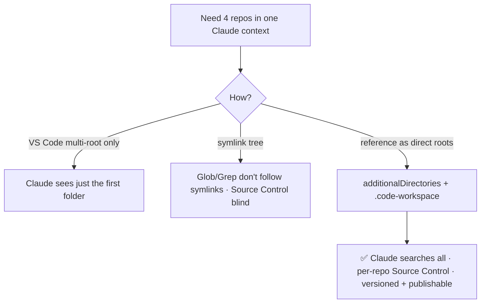

# create-workspace

Stitch several existing repos into one Claude Code context for cross-repo feature work — without copying or symlinking them. The workspace is a small versioned git repo that *references* the others, so Claude (CLI **and** the VS Code extension) sees them all, and VS Code shows each as its own folder with working Source Control.

## Why not just open the folders / symlink them?



The engine is `permissions.additionalDirectories` in the workspace's `.claude/settings.json` — the editor-agnostic way to grant Claude file access to repos outside the project root. A multi-root `.code-workspace` mirrors it for the VS Code GUI.

## What it does

```
<name>/
├── CLAUDE.md               # what each repo is + how to maintain the workspace
├── .claude/settings.json   # permissions.additionalDirectories = [real repo paths]
└── <name>.code-workspace   # multi-root: the workspace dir + each repo
```

Given a workspace name and some repos — by **path**, by **bare name** (fuzzy-found in your git tree), or pulled from a **Jira ticket** — it scaffolds the dir, writes a brief `CLAUDE.md` summarizing each repo, creates the GitLab project, pushes, and opens it in VS Code.

## Usage

> create a workspace named nestjs-upgrade with cold-brew, portal, acs

> create a workspace for ORDR-1234

The workspace is published over SSH to the GitLab host **inferred from the added repos' git remotes**.

### Add or remove repos later

Just ask Claude in the workspace:

> add the design-system repo to this workspace

> remove acs from this workspace

Both reference files stay in sync automatically.

## Expected directory layout

Assumes your repos are cloned in a `~/git/<Org>/<Platform>/<remote-path>` tree — i.e. the local path mirrors the remote. A GitLab repo at `gitlab.example.com/team/api`, for instance, lives at `~/git/<Org>/Gitlab/team/api`. [git-sync](https://github.com/uPaymeiFixit/git-sync) sets up and maintains exactly this layout — recommended if you don't already mirror your remotes locally.

A new workspace is created at `~/git/<Org>/Gitlab/<username>/<name>`, mirroring where it will live on GitLab, so a folder-level git-sync keeps it in step. The defaults target `~/git/Paciolan/Gitlab`; point them elsewhere if your tree differs.

Because everyone mirrors the same tree, repo references are stored as paths **relative to the workspace** (e.g. `../../ballena/cold-brew`) rather than absolute. A teammate who clones one of your workspaces gets working references with no path rewriting — no `/Users/<you>` prefix to break. Repos outside the mirrored tree fall back to absolute paths (and aren't portable).

## Requirements

`glab` (the GitLab CLI) authenticated to your GitLab host, and SSH access to it.
