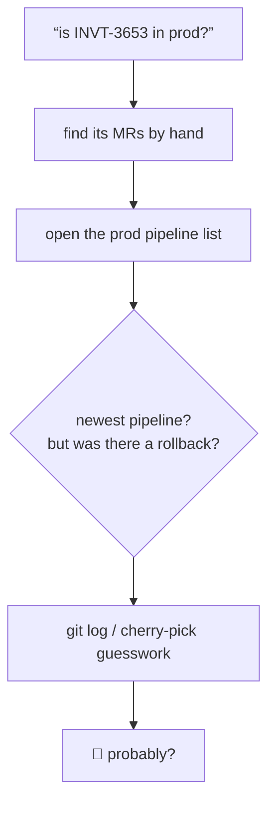
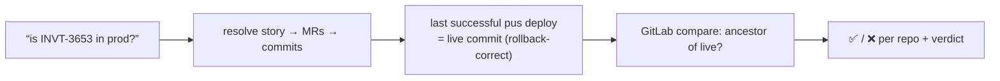

# is-this-in-prod

Answer "is this commit / MR / Jira story in production right now?" by checking what GitLab actually has deployed to the prod environment, rollbacks included.

> [!NOTE]
> "Production" is a GitLab environment named `pus`. To fork: change `PROD_ENV` in [SKILL.md](SKILL.md). The logic is generic — it reads deployments and commit ancestry straight from the GitLab API.

### Old way



### New way



## Usage

> is INVT-3653 in production?

> did MR !412 in order-ms ship to prod?

> is commit a1b2c3d deployed to pus yet?

Takes a Jira key, an MR (URL or IID), and/or a raw commit SHA — any mix.

## What it does

1. **Resolves the input to `(project, commit)` anchors.** A commit or MR is direct; a Jira key fans out to every linked MR (via the [fixed-in-build](https://github.com/uPaymeiFixit) resolution chain — remote links, the Fixed in Build field, comments, description) across however many repos it touches.
2. **Finds the live prod commit per repo** — the most recent *successful* deployment to the `pus` environment via GitLab's Deployments API. Because a rollback is just a newer successful deploy of an older commit, the latest success is always what's actually serving.
3. **Asks GitLab whether each anchor is in prod** with the server-side compare API: if the prod commit reaches the anchor, it's deployed. No clone, no local `git`.
4. **Reports a verdict per repo**, then an overall answer — a story is only *fully* in prod when every one of its MRs is.

## Use cases

### A single MR or commit

```
did this MR ship?
```

Reads the MR's merge commit, finds what `pus` is serving for that repo, and tells you whether the merge commit is an ancestor of the live one — and if not, how many commits behind.

### A Jira story spanning several microservices

```
is INVT-3653 in production?
```

The story links MRs in `order-ms`, `cart-ms-next`, and `gql-ms`. Each is checked against *its own* repo's live prod commit. If two shipped and one is still merged-but-undeployed, you get **partially deployed** with the laggard named.

### Sanity-checking after a rollback

```
we rolled back order-ms last night — is my fix still live?
```

The skill compares against the *currently serving* commit, not the newest pipeline, so a rollback that reverted past your fix shows up as ❌ even though a later pipeline exists.

## Tooling

- [`glab`](https://gitlab.com/gitlab-org/cli) authenticated to your GitLab host — deployments, environments, commit compare (or the GitLab MCP server)
- Atlassian/Jira access (MCP or REST) — only needed when the input is a Jira key
- Related: [fixed-in-build](https://github.com/uPaymeiFixit) for the Jira-key → MR resolution chain this reuses
