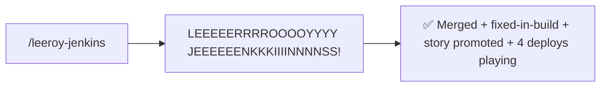

# leeroy-jenkins

Ship a GitLab MR end-to-end — approve, merge, update Fixed in Build, promote the Jira story, and play the lab deploy jobs.

### Old way


### New way



## Usage

Run from a branch with an open MR. Defaults to deploying to all four lab envs.

### As a slash command

```
/leeroy-jenkins
```

```
/leeroy-jenkins dev qfnq        # subset of envs
```

### As a natural-language skill

Trigger phrases:

> leeroy jenkins!

> ship it

> merge and deploy

## What it does

1. **Lowers approvals to 1** if the MR requires more and you're allowed to approve. Bails if "Prevent approval by author" is on.
2. **Approves** the MR as you.
3. **Merges** — immediately if the pipeline is green, or queues auto-merge (`merge_when_pipeline_succeeds`). Waits via `ScheduleWakeup` rather than polling.
4. **Reads failed pipelines** — retries transient/infra failures once, summarizes real failures and proposes a fix (or stops and hands back if non-trivial). Never merges over a real failure.
5. **Invokes [fixed-in-build](https://gitlabdev.paciolan.info/development/tools/pac-skills/-/blob/master/skills/jira/fixed-in-build/README.md)** with the master-pipeline URL to update Jira.
6. **Promotes the Jira story** from *Code Review* → *Dev Complete* if applicable. Leaves any other status alone.
7. **Plays the lab deploy jobs** (`Deploy To Dev`, `Deploy To QFNQ`, `Deploy To QFNS`, `Deploy To Auto`) in parallel, after their prerequisites (`test`, `package-non-prod`) succeed.

## Use cases

### Ship a green MR

```
/leeroy-jenkins
```

MR pipeline is already green. The skill approves, merges, updates Jira, and fires the four deploys in parallel. ~30 seconds of clicks become one command.

### Queue auto-merge while CI runs

```
/leeroy-jenkins
```

Pipeline still running. Skill approves, sets auto-merge, sleeps via `ScheduleWakeup`, then resumes once the merge commit lands and plays deploys.

### Subset of envs

```
/leeroy-jenkins dev qfnq
```

Skip `qfns` and `auto` — useful when you only care about one or two environments for a quick smoke test.

### Pipeline fails

The skill reads the failing job's log. Network blip → retries once. Real test failure → it summarizes, points at the file/line, and proposes a fix; you decide. Either way it stops short of merging over a failure.

## Hard rules

- Never plays `Deploy to Prod/PUS` or `Release` — those are tag-gated, deliberate, user-only.
- Never approves or lowers approvals on someone else's MR without an explicit ask.
- Never merges over a failing pipeline.

## Tooling

- **GitLab MCP server** — approvals, merge, pipeline introspection, job play/retry.
- `glab` — used only for the `approvals` REST endpoint (the MCP equivalent doesn't return `user_can_approve` / `require_password_to_approve`).
- **[fixed-in-build](https://gitlabdev.paciolan.info/development/tools/pac-skills/-/blob/master/skills/jira/fixed-in-build/README.md)** skill — Jira "Fixed in Build" + repo label.
- **[jira-defaults](https://gitlabdev.paciolan.info/development/tools/pac-skills/-/blob/master/skills/jira/jira-defaults/README.md)** skill — transition IDs for the *Code Review → Dev Complete* promotion.
