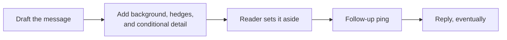
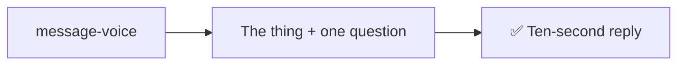

# message-voice

Voice rules for prose a human reads — say the one thing, plain words, let the reader pull the rest.

### Old way

### New way

## Usage

Auto-invokes whenever Claude writes something a human will read and react to: chat replies, summaries, reports, artifacts, Slack messages, emails, MR comments. Also when you start asking questions or say something like:

> I want to understand this

> let me ask some questions

To invoke it by hand — or to tell Claude a reply was too much and to cut it down:

> message voice

> too wordy — just answer the question

## What it does

1. Leads with the concrete thing — the artifact, the ask, the finding — then stops.
2. Cuts pre-hedging ("no rush, just a heads-up"), meta-narration, conditional detail, over-qualifying, and big words.
3. Keeps messages in text register: short, informal, no headings, one ask per message.
4. Applies the same pull-don't-push rules to longer forms — reports and artifacts lead with the finding and only use structure the reader will navigate by.

## Tooling

None — pure prose guidance, no scripts or external dependencies.
