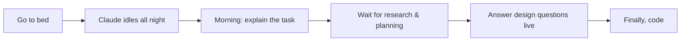
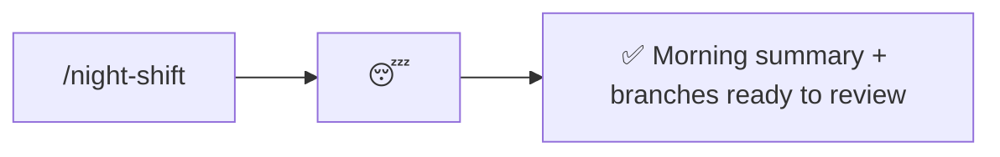

# night-shift

Work autonomously overnight — research, plan, experiment, and land straightforward features on separate branches — then deliver a brutally concise morning summary.

### Old way



### New way



## Usage

Optionally pass a return time (default 6am) and tasks. With no tasks, Claude has full autonomy to decide what to work on.

### As a slash command

```
/night-shift
```

```
/night-shift 7:30am finish the retry logic, then look into the flaky e2e suite
```

### As a natural-language skill

Trigger phrases:

> I'm going to bed

> night shift

> work on this overnight, see you in the morning

## What it does

1. Works the given tasks — or picks its own: research, planning, experiments, even landing features that are straightforward enough.
2. Researches its way past questions instead of blocking on you. Anything genuinely ambiguous gets documented for the morning, or built out as one branch per likely design direction so your answer just picks a winner.
3. Keeps every change on separate branches for you to review and merge in the morning.
4. Orchestrates rather than executes — planning delegated to Opus subagents, execution to Sonnet subagents — so its own context lasts the night.
5. Checks the real clock with `date` (never guesses elapsed time) and works until your return time, squeezing in one more task when there's an hour to spare.
6. Writes a morning summary artifact: what happened, branches created, and design-fork questions with a recommendation. Brutally concise.

## Use cases

### Hand off a task list

```
/night-shift 6am migrate the config loader to zod, and see if the docker build can be cached better
```

Claude works the list overnight, one branch per item, and you wake up to reviewable diffs instead of a to-do list.

### Full autonomy

```
/night-shift
```

No tasks given — Claude finds its own work: backlog items, cleanups, experiments, research into open questions.

### Design forks

If Claude hits a real decision it can't resolve by research (two viable architectures, say), it builds both directions on separate branches. In the morning you answer one question and the chosen path is already implemented.
