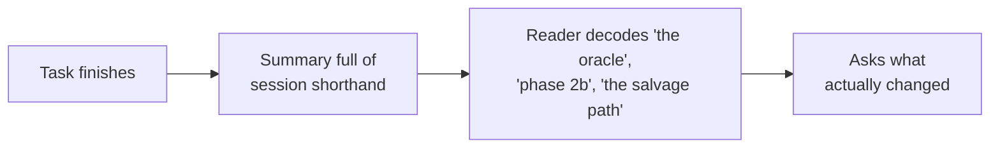
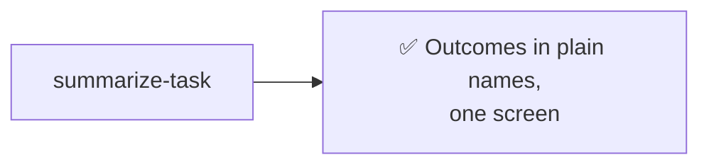

# summarize-task

Summarize finished work for a reader who wasn't watching — outcome first, plain names, no session-invented jargon.

### Old way

### New way

## Usage

Invoke it directly when you come back to a session:

> summarize the task

> what did you do while I was gone

> handoff summary

Or as a slash command: `/summarize-task`

It's also designed to be called by other skills as their final reporting step — e.g. [orchestrate-task](../../../orchestrate-task/skills/orchestrate-task/README.md) after its pipeline finishes, or [night-shift](../../../night-shift/skills/night-shift/README.md) for the morning handoff.

## What it does

1. Leads with the outcome — what now works or exists, and where it lives (branch, MR, files).
2. Names everything by what it literally is; strips any label Claude coined mid-session that you never saw.
3. Lists decisions made on your behalf, open questions with a recommendation each, a one-line-per-file manifest, and anything left unverified.
4. Keeps it to executive altitude — no diff walkthrough, no tool-call narration.

## Tooling

None — pure prose guidance, no scripts or external dependencies.
