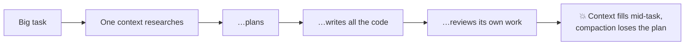
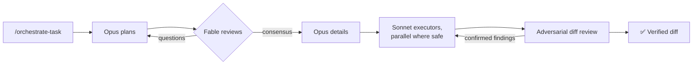

# orchestrate-task

Run a medium-sized task through a model-tiered subagent pipeline — Opus plans, Fable reviews the plan, Sonnet executes, and a bundled adversarial-review workflow verifies the diff.

### Old way



### New way



## Usage

```
/orchestrate-task <task description>
```

> "Orchestrate this migration"

> "This is a big one — use the task pipeline"

Also auto-triggers when Claude picks up a task likely to run more than ~15 turns or span many files.

## What it does

The main context stays a pure orchestrator — subagents do the reading and writing, so the plan survives the whole task.

1. **Plan (Opus)** — deep research, then a high-level architectural plan; multiple options when there's a real design fork.
2. **Review (Fable)** — adversarially reviews the plan end-to-end. It doesn't research on its own; open questions go back to another Opus agent, looping until consensus.
3. **Detail (Opus)** — turns the agreed plan into concrete execution units, split for parallel work where safe.
4. **Execute (Sonnet)** — executors implement exactly what's specified. Decisions route back to a planner instead of being improvised.
5. **Verify** — the project's own tests/checks, then an adversarial review of the resulting diff: one finder per dimension proposes defects, and a verifier per finding tries to refute it. Only CONFIRMED findings go back for fixes.

Prefer not to burn Fable tokens? Say so — the pipeline substitutes Opus for the review stage.

## The bundled review workflow

Plugins can't ship Workflow-tool workflows as a first-class component, so this skill bundles [workflows/adversarial-review.js](workflows/adversarial-review.js) inside the skill directory and passes it to the Workflow tool by path. It is repo-generic:

- `repoPath` (required) anchors every git command and file read — the script refuses to run unanchored rather than silently reviewing the wrong repo.
- `diffCmd`, `context`, `dimensions`, `findModel`, `verifyModel` are all overridable args.
- `branchGlobs` (optional) also checks for unmerged sibling branches that should be combined into one review; omitted by default.

It's equally usable standalone, outside this pipeline, for reviewing any diff.

## Tooling

- The **Workflow** orchestration tool, built into Claude Code — used for the verification review. When unavailable, the skill falls back to plain subagents in the same finder/verifier shape.
- Access to **Opus**, **Sonnet**, and (optionally) **Fable** models via the Agent tool. The Opus stages run through the bundled [task-planner agent](../../agents/task-planner.md), which pins the Opus version — the `opus` alias would otherwise follow whichever Opus your session is set to.
- No external CLIs or MCP servers.
